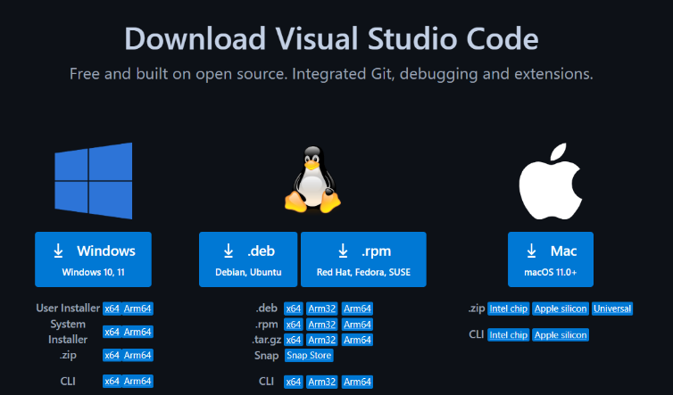
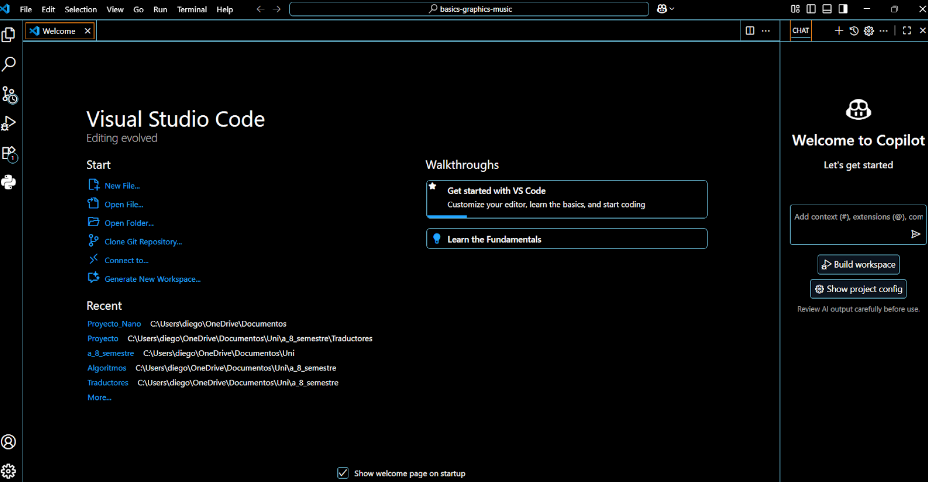
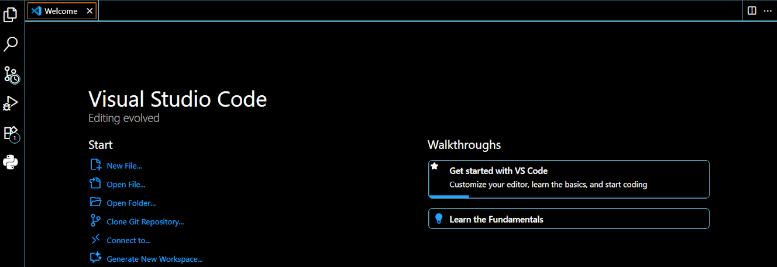
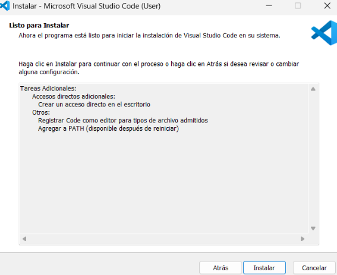
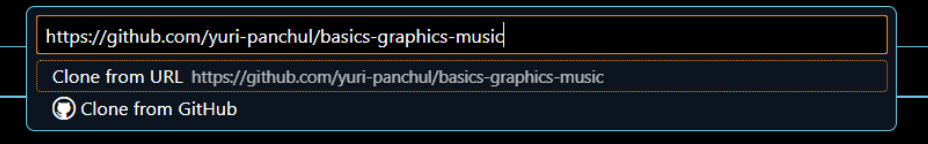
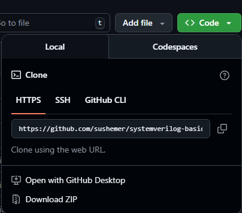

# Linux install guide · Visual Studio Code, Git, repository, and Gowin IDE

This document describes how to prepare the environment on **Linux** to work with this repository.

---

## 1. Visual Studio Code (VSC)

### 1.1 Download VSC

1. Open the official website:  
   https://code.visualstudio.com/download
2. Select the package corresponding to your Linux distribution (`.deb`, `.rpm`, etc.).
3. Download the installer file.

### 1.2 Installation

Depending on your distribution, the installation may vary:

- **Debian/Ubuntu (.deb):**

sudo dpkg -i code_*.deb  
sudo apt-get -f install

- **Fedora/openSUSE (.rpm):**

sudo rpm -i code-*.rpm

### 1.3 Initial launch

Open Visual Studio Code from your applications menu or via terminal:

code

---

## 2. Git Installation

Git is required to clone and manage the repository.

### 2.1 Installing Git

- **Debian/Ubuntu:**

sudo apt-get update  
sudo apt-get install git

- **Fedora:**

sudo dnf install git

- **Arch Linux:**

sudo pacman -S git

### 2.2 Verify installation

git --version

---

## 3. Download or clone the project repository

> It is recommended to store the project in a folder **without spaces** in the path.

Main repository of this project:

https://github.com/sushemer/systemverilog-basic

### 3.1 Clone using Git (recommended)

1. Create a workspace folder (without spaces), for example:

mkdir -p ~/ProyectosFPGA  
cd ~/ProyectosFPGA

2. Clone the repository:

git clone https://github.com/sushemer/systemverilog-basic.git

3. Enter the project folder:

cd systemverilog-basic

### 3.2 Download as ZIP (without Git)

1. Open in your browser:  
   https://github.com/sushemer/systemverilog-basic
2. Click **Code → Download ZIP**.
3. Save the ZIP file.
4. Extract it:

unzip systemverilog-basic-main.zip  
mv systemverilog-basic-main systemverilog-basic

5. Open in VS Code:

code systemverilog-basic

---

## 4. Install Gowin IDE (Linux)

### 4.1 Download Gowin IDE

1. Go to:  
   https://www.gowinsemi.com/en/support/download_eda/
2. Download the **Education** version for Linux.
3. Save the `.tar.gz` file in your Downloads folder.

### 4.2 Extract the installer

cd ~/Descargas  
tar -xvzf Gowin_V1.x.x_Education_linux.tar.gz

This will create a folder like:

Gowin_V1.x.x_Education_linux/

### 4.3 Move Gowin to a known location

rm -rf ~/gowin  
mv Gowin_V1.x.x_Education_linux ~/gowin

---

## 5. Configure environment variables

### 5.1 Edit `.bashrc`

nano ~/.bashrc

Add the following lines at the end:

export PATH="$PATH:$HOME/gowin/IDE/bin:$HOME/gowin/Programmer/bin"

Save and exit (`Ctrl + O`, `Enter`, `Ctrl + X`).

### 5.2 Apply the changes

source ~/.bashrc

---

## 6. Verify installation

### 6.1 Verify using the console

gw_sh

### 6.2 Verify using the graphical IDE

gw_ide &

If the IDE opens successfully, your Gowin installation on Linux is complete.
