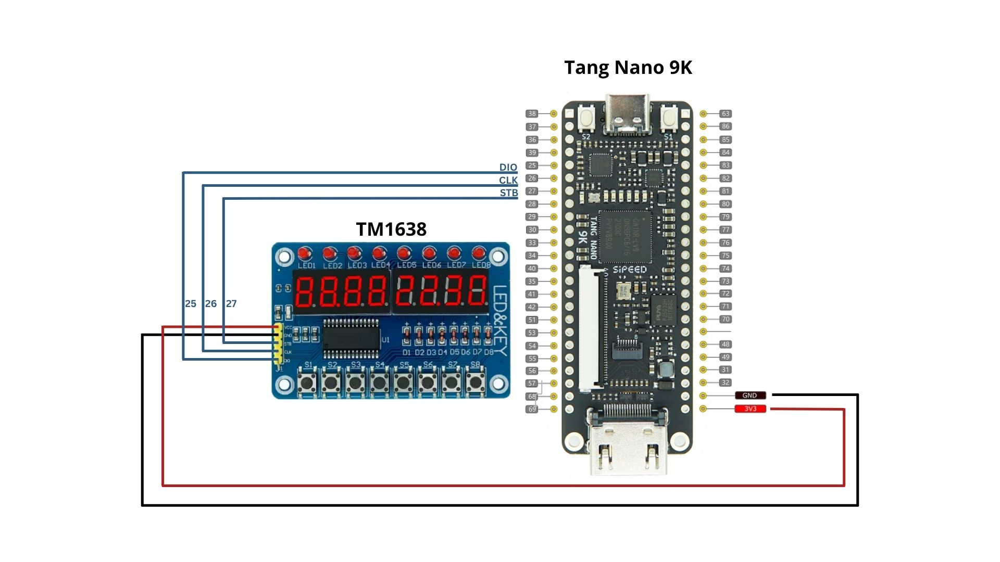
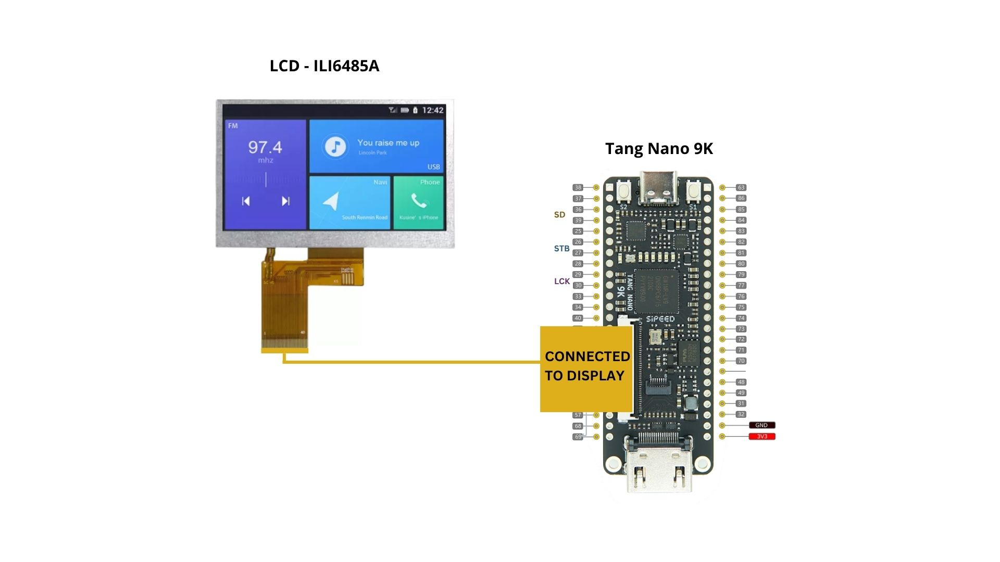
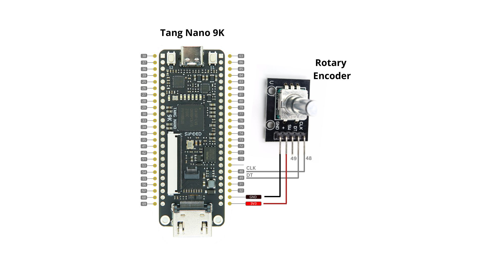
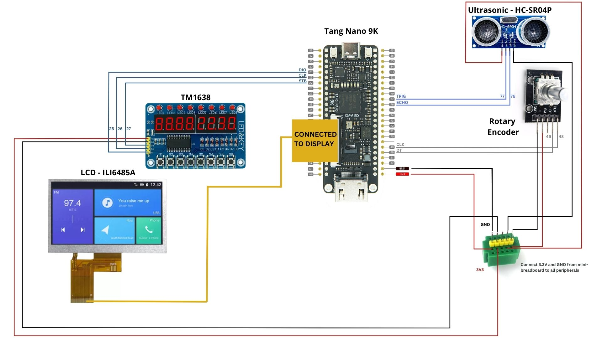

# 1.5.1 Conexiones – Tang Nano 9K + Periféricos

Esta carpeta documenta **cómo está todo cableado** alrededor de la Tang Nano 9K:

- Una foto por cada dispositivo conectado a la Tang Nano 9K.
- Una foto con **todos los dispositivos conectados al mismo tiempo**.
- Notas breves sobre alimentación, señales y detalles importantes (“gotchas”).

Todas las fotos se encuentran en en:

- `Mult/`.

---

## 1. Reglas generales de cableado

Antes de hablar de cada dispositivo:

1. **Tierra común**
   - La GND de la Tang Nano y la GND de **cada** módulo externo deben estar conectadas entre sí.
   - Si se usa una fuente externa de 5 V (para la LCD o el ultrasónico), **debe compartir GND** con la Tang.

2. **Niveles de voltaje**
   - Los pines de I/O de la Tang Nano 9K son **solo 3.3 V**.
   - Si un módulo es “compatible con 5 V”, se debe revisar:
     - Alimentarlo a 5 V **solo si** sus entradas reconocen 3.3 V como nivel ALTO.
     - De lo contrario, usar un **conversor de nivel** o alimentarlo a 3.3 V si lo permite.

3. **Mantener los cables cortos y claros**
   - Usar jumpers cortos para señales de clock / datos.
   - Etiquetar o usar código de colores: por ejemplo, rojo = VCC, negro = GND, amarillo/verde = señales.

---

## 2. Tang Nano 9K + TM1638

**Objetivo:** usar el TM1638 como un módulo combinado de **display 8×7 segmentos + 8 LEDs + 8 teclas**.

Señales típicas:

- `VCC` → 5 V (o 3.3 V si la tarjeta TM1638 lo soporta).
- `GND` → tierra común con la Tang.
- `STB` (STROBE / LATCH) → pin GPIO de la Tang.
- `CLK` → pin GPIO de la Tang.
- `DIO` (datos entrada/salida) → pin GPIO de la Tang.

En este repositorio, los pines exactos se definen en el archivo de restricciones de la tarjeta  
(por ejemplo `boards/tang_nano_9k_lcd_480_272_tm1638_hackathon/board_specific.cst`).

**Referencia de foto:**

La imagen debe mostrar claramente:

- La placa Tang Nano 9K.
- El módulo TM1638.
- Cables de `VCC`, `GND`, `STB`, `CLK`, `DIO`.

---

## 3. Tang Nano 9K + LCD 480×272

**Objetivo:** usar la LCD de 4.3" / 480×272 como salida gráfica principal.

Conexiones típicas (nivel conceptual):

- Líneas de datos/clock/control desde la Tang hacia el conector de la LCD (ya definidas en la placa).
- `VCC` (a menudo 3.3 V para lógica, y 5 V para backlight según el panel).
- `GND` común entre la Tang y la placa de la LCD.

En muchos montajes, la placa base de la Tang Nano ya expone un **conector LCD compatible**.  
Si se replica esto en un hardware propio, se debe seguir el mapeo de pines de:

- `lcd_480_272.sv`
- El archivo `.cst` correspondiente a esta tarjeta.

**Referencia de foto:**

---

## 4. Tang Nano 9K + Sensor ultrasónico (HC-SR04)

**Objetivo:** medir distancia usando el módulo `ultrasonic_distance_sensor`.

Cableado típico:

- `VCC` → 5 V (la mayoría de los HC-SR04 trabajan a 5 V.  
  Si la señal ECHO es de 5 V, **se debe usar un divisor resistivo o level shifter** hacia la Tang).
- `GND` → tierra común con la Tang.
- `TRIG` → pin GPIO de la Tang (salida).
- `ECHO` → pin GPIO de la Tang (entrada, **máximo 3.3 V**).

En el repositorio, normalmente TRIG/ECHO se asignan a `gpio[0]` / `gpio[1]` en `hackathon_top.sv`,   pero los **pines físicos reales** se definen en el archivo `.cst`.

**Referencia de foto:**

---

## 5. Tang Nano 9K + Potenciómetro (vía ADC o demo simple)

Según el montaje, el potenciómetro puede:

- Conectarse a un módulo ADC externo (SPI / I²C) y luego a la Tang.
- Usarse en una demo sencilla (por ejemplo, como parte de un divisor de voltaje para la entrada de un ADC).

Cableado típico (genérico):

- `Pin central del potenciómetro` → entrada del ADC (en el módulo ADC externo).
- `Pin lateral 1` → 3.3 V.
- `Pin lateral 2` → GND.
- Módulo ADC → Tang vía pines SPI/I²C (consultar el lab / actividad y `.cst` para los pines exactos).

**Referencia de foto:**

---

## 6. Todos los dispositivos juntos

Foto final: todos los periféricos principales conectados a la vez, como se usan en los labs/activities.

Conjunto típico:

- Tang Nano 9K.
- TM1638.
- LCD 480×272.
- Sensor ultrasónico HC-SR04.
- Potenciómetro (y opcionalmente el encoder).

**Referencia de foto:**

---

## 7. Dónde encontrar el mapeo exacto de pines

Este documento se centra en las conexiones de forma **visual y conceptual**.

Para ver los **nombres y números exactos de pines** en la Tang Nano 9K:

- Consultar el archivo de restricciones de la variante de tarjeta usada, por ejemplo:

  - `boards/tang_nano_9k_lcd_480_272_tm1638_hackathon/board_specific.cst`

Ahí se pueden encontrar mapeos como:

- `TM1638_STB` → pin físico `XX`
- `LCD_R0`     → pin físico `YY`
- `GPIO0`      → pin físico `ZZ`

Esos archivos son la referencia oficial al momento de cablear hardware propio.
