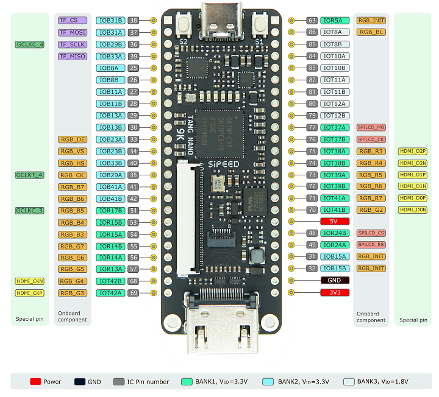

# Tang Nano 9K · Main Board

The **Tang Nano 9K** is the main FPGA board used in this repository.  
Here we document how it is used within the project and where to find the key information needed to work with it.

---

## Role in the repository

In this project, the Tang Nano 9K is used as the base platform to:

- Test simple examples (counters, FSM, PWM, etc.).
- Develop activities and labs with sensors and actuators.
- Implement mini-projects in the `6_implementation` folder.

All the pin configuration and electrical notes related to the board are centralized in this folder.

---
