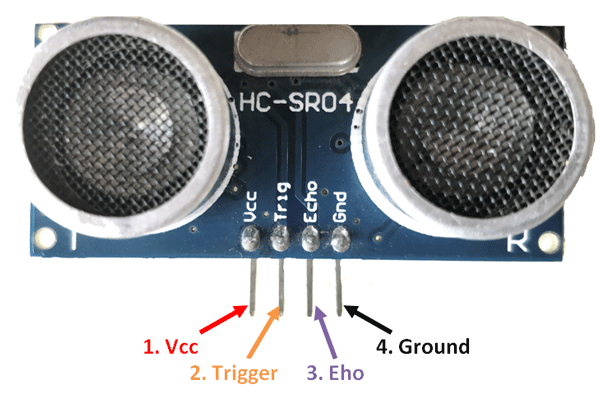

# 2.2.1 HC-SR04 · Ultrasonic distance sensor

The **HC-SR04** is a sensor that measures distance using ultrasound.  
It works by sending a high-frequency sound pulse and measuring the time it takes for the echo to return.

In this repository it is used to:

- Measure distance in centimeters.
- Display the result on:
  - 7-segment displays.
  - TM1638 module.
  - 16x2 LCD.
- Build mini-projects such as proximity meters.

---

## Signals and logical pins

The HC-SR04 module has four main pins:

- `VCC` → power supply (typically 5 V).
- `GND` → common ground (must be connected to the same GND as the Tang Nano 9K).
- `TRIG` → trigger input (from the FPGA).
- `ECHO` → echo output (to the FPGA).

In code, names such as:

- `hcsr04_trig`
- `hcsr04_echo`

are commonly used.

The assignment to physical pins is documented in:

- `2_1_Boards/2_1_1_Tang_Nano_9K/docs/pinout.md`
- `2_1_Boards/2_1_1_Tang_Nano_9K/constr/tang-nano-9k.cst`

---

## Operating principle

1. The FPGA generates a short pulse on `TRIG` (e.g., 10 µs).
2. The sensor emits an ultrasonic pulse train.
3. When the echo returns, the sensor holds `ECHO` high for a time proportional to the distance.
4. The FPGA measures the **pulse width** on `ECHO` using a counter based on the clock.
5. With that count, the approximate distance in centimeters is calculated.

Typical formula (approximate):

- distance (cm) ≈ (echo_time_in_seconds * speed_of_sound) / 2
