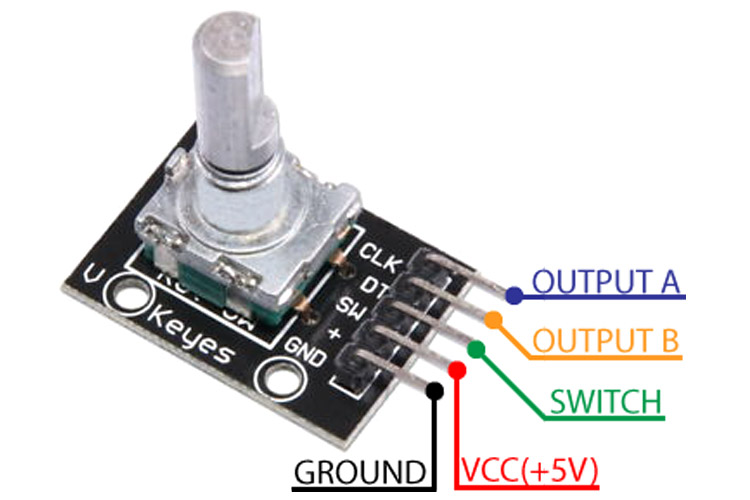

# 2.2.2 Rotary Encoder · Digital knob

The **rotary encoder** is a “digital knob” that generates two quadrature signals (`A` and `B`) when rotated, and many modules also include a button (`SW`).

In this project, it serves as the **main rotary control**, i.e., it is used where in other contexts a potentiometer would be used to adjust values or navigate options.

It is used for:

- Increasing or decreasing a value (e.g., a counter).
- Adjusting parameters (speed, brightness, thresholds).
- Moving between options of a simple menu.

---

## Signals and logical pins

A typical rotary encoder module exposes:

- `ENC_A` → A signal (quadrature).
- `ENC_B` → B signal (quadrature).
- `ENC_SW` → integrated button (optional, by pressing the knob).
- `VCC`, `GND` → power (usually 3.3 V or 5 V, depending on the module).

In the code you may see names such as:

- `enc_a`
- `enc_b`
- `enc_sw` (if the integrated button is used)

The assignment to physical pins is documented in:

- `2_1_Boards/2_1_1_Tang_Nano_9K/docs/pinout.md`
- `2_1_Boards/2_1_1_Tang_Nano_9K/constr/tang-nano-9k.cst`

---

## Operating principle

- When turning the encoder, `ENC_A` and `ENC_B` change state with a phase shift (**quadrature**).
- By observing the order of changes of `A` and `B`, one can determine:
  - If the rotation was **clockwise** (increment).
  - Or **counterclockwise** (decrement).
- The `ENC_SW` button behaves as a normal pushbutton (requires debouncing).

A typical implementation:

- A FSM or sequential logic that:
  - Detects changes in `A/B`.
  - Updates an internal counter.
  - Limits the value to a range (e.g., 0–9, 0–99, etc.).

---

## Connection and safety notes

- Verify the voltage level of the encoder module:
  - If the output is 3.3 V, it can be connected directly to the FPGA.
  - If it is 5 V, use level shifting or a module compatible with 3.3 V.
- Always connect **common GND** between:
  - Tang Nano 9K.
  - Rotary encoder.

---

## Relation to theory

This device is based on the following topics from `1_2_Theory`:

- `1_2_4_Combinational_vs_Sequential.md`  
  Difference between combinational and sequential logic (counting is sequential).

- `1_2_5_Registers_and_Clock.md`  
  Using registers to store the current counter value.

- `1_2_7_Finite_State_Machines.md`  
  A simple FSM to interpret A/B quadrature.

- `1_2_8_Debouncing_and_Edge_Detection.md`  
  To clean the `ENC_SW` button signal and detect edges.

---

## Related examples, activities, and labs

Typical ideas for this device:

- **Examples**
  - Counter controlled by encoder (up/down value).
  - Change the time-divider value by turning the encoder.

- **Activities**
  - Use the encoder to select a mode on TM1638 or LCD.
  - Adjust the “near/far” threshold for the HC-SR04.

- **Labs / Implementation**
  - Simple menu where:
    - Navigation is done with the encoder.
    - Options are selected with the `ENC_SW` button.

Exact names of Examples/Activities/Labs may change once the corresponding folders are defined.

---
