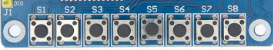

# 2.2.3 Buttons & Switches · Buttons and switches

This folder documents the use of **simple digital inputs**:

- The built-in buttons on the Tang Nano 9K (`KEY[0]`, `KEY[1]`).
- External pushbuttons or micro-switches, if added on the breadboard.

The concepts in this section also apply to other keys/buttons used in the project, for example:

- The keys on the **TM1638** module (although their specific reading is documented in `2_3_2_TM1638`).

---

## Purpose

Buttons and switches are used to:

- Change states in a **FSM**.
- Start or stop counters.
- Change operating modes (e.g., select what is shown on a display).

They are one of the simplest ways to interact with the FPGA.

---

## Signals and logical pins

Typical examples of signals:

- `btn_a`, `btn_b` → user buttons.
- `sw_mode` → mode-selection switch.

On the Tang Nano 9K, the built-in buttons are usually mapped as:

- `KEY[0]`
- `KEY[1]`

with their physical pins defined in:

- `2_1_Boards/2_1_1_Tang_Nano_9K/docs/pinout.md`
- `2_1_Boards/2_1_1_Tang_Nano_9K/constr/tang-nano-9k.cst`

---

## Key concepts

### Pull-up / Pull-down

A button is usually connected:

- Between the signal and **GND**, with a **pull-up** resistor to VCC, or
- Between the signal and **VCC**, with a **pull-down** resistor to GND.

In many cases:

- The board already includes the pull-up/pull-down.
- With external buttons, you may need to add them on the breadboard.

### Bounce (debouncing)

Mechanical contacts do not switch cleanly from 0 to 1; they “bounce” for a few milliseconds.  
To prevent one click from counting as multiple presses, **debouncing** is used:

- Hardware (RC + Schmitt trigger, when applicable).
- Digital logic (counters, time filters).

### Edge detection

Often you only want to detect “when the button is pressed” (rising edge) or “when it is released” (falling edge), not the constant level.  
This can be done with:

- Registers storing the previous value.
- Comparing current vs. previous value.

---

## Relation to other devices

- **Rotary Encoder**  
  The `ENC_SW` button behaves the same way as a normal button:
  - Needs debouncing.
  - Can be used to “accept” or “enter” an option.

- **TM1638**  
  The TM1638 keys are also digital inputs, only:
  - They are read using the module’s communication protocol.
  - They share signals (`DIO`, `CLK`, `STB`).

Concepts of **pull-up**, **bounce**, and **edges** remain the same.

---

## Relation to theory

This device relies on the following topics in `1_2_Theory`:

- `1_2_4_Combinational_vs_Sequential.md`  
  Sequential logic to store states and edges.

- `1_2_7_Finite_State_Machines.md`  
  Using buttons to advance or reset states.

- `1_2_8_Debouncing_and_Edge_Detection.md`  
  Techniques to clean mechanical signals and detect correct edges.

---

## Related examples, activities, and labs

Typical ideas:

- **Examples**
  - Turn a LED on/off with a button.
  - Switch between two LED patterns with a switch.

- **Activities**
  - Implement a counter that only advances on the rising edge of a button.
  - Create a traffic-light FSM controlled by a “pedestrian” button.

- **Labs / Implementation**
  - Menu controlled by buttons:
    - One button to move forward through options.
    - Another to select/confirm.

Exact names of Examples/Activities/Labs may change when the corresponding folders are defined.

---
