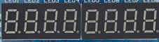

# 2.3.1 Seven Segment · Displays de 7 segmentos


Los **displays de 7 segmentos** se utilizan para mostrar números (0–9, 0–F) y algunas letras simples.  
En este repositorio se usan principalmente para:

- Contadores binarios/hexadecimales.
- Indicadores de estado o modo.
- Visualización básica de resultados (por ejemplo, distancia aproximada, nivel, etc.).

Pueden ser de **un dígito** o de **varios dígitos** (con multiplexado).

---

## Señales y pines lógicos

Un dígito de 7 segmentos típico tiene:

- 7 segmentos: `a, b, c, d, e, f, g`.
- Punto decimal opcional: `dp`.
- Un terminal común (ánodo común o cátodo común).

En el código suele representarse como:

- `seg[6:0]` → segmentos `a..g`.
- `dp` → punto decimal (opcional).
- `en_digit[n:0]` → habilitación de dígitos (cuando hay más de uno).

Ejemplo de nombres:

- `seg[6:0]`
- `seg_dp`
- `digit_en[3:0]` (para 4 dígitos)

La asignación a pines físicos concretos se documenta en:

- `2_1_Boards/2_1_1_Tang_Nano_9K/docs/pinout.md`
- `2_1_Boards/2_1_1_Tang_Nano_9K/constr/tang-nano-9k.cst`

---

## Conceptos clave

### Tipo de display: ánodo común vs cátodo común

- **Ánodo común**: segmentos se encienden llevando la señal a nivel bajo (0).
- **Cátodo común**: segmentos se encienden llevando la señal a nivel alto (1).

Esto afecta:

- La lógica del decodificador (si se usa inversión).
- La interpretación de los bits en el mapa de segmentos.

### Mapa de segmentos

Cada número/letra se codifica como un patrón de segmentos encendidos/apagados.  
Por ejemplo, para un display donde `1` se representa encendiendo solo `b` y `c`:

```
a b c d e f g
0 1 1 0 0 0 0
```