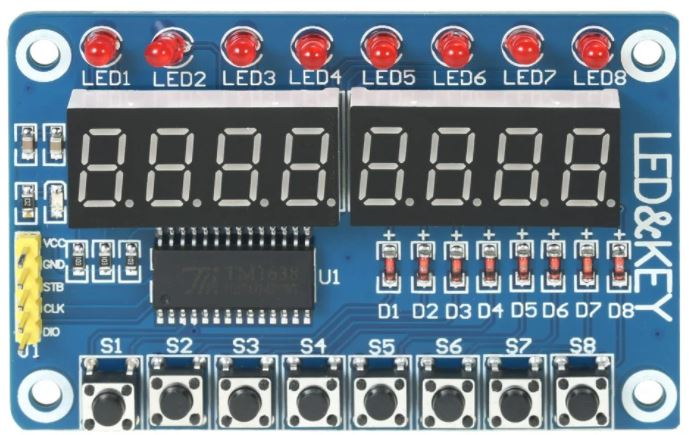

# 2.3.2 TM1638 · Módulo 7 segmentos + LEDs + teclas

El módulo **TM1638** integra en una sola tarjeta:

- 8 dígitos de 7 segmentos.
- 8 LEDs individuales.
- 8 teclas (buttons).

Todo controlado por el chip **TM1638**, que se comunica con la FPGA mediante un protocolo síncrono sencillo.

En este repositorio se utiliza como una interfaz de usuario compacta para:

- Mostrar números y estados.
- Encender/apagar LEDs.
- Detectar teclas presionadas.

---

## Señales y pines lógicos

El TM1638 utiliza tres líneas principales hacia la FPGA:

- `TM_DIO` → línea de datos (bidireccional).
- `TM_CLK` → reloj de comunicación.
- `TM_STB` → señal de “strobe” o selección del módulo.

En el código se pueden usar nombres como:

- `tm_dio`
- `tm_clk`
- `tm_stb`

Estas líneas se conectan a pines `GPIO[x]` de la Tang Nano 9K y se documentan en:

- `2_1_Boards/2_1_1_Tang_Nano_9K/docs/pinout.md`
- `2_1_Boards/2_1_1_Tang_Nano_9K/constr/tang-nano-9k.cst`

---

## Conceptos clave

### Protocolo básico

El TM1638 se maneja enviando y recibiendo “frames” de bits a través de `TM_DIO`, sincronizados con `TM_CLK`, y usando `TM_STB` para indicar el inicio/fin de una operación.

Operaciones típicas:

- Enviar comandos de configuración.
- Escribir datos para los dígitos de 7 segmentos y LEDs.
- Leer el estado de las teclas.

### Entradas y salidas en un mismo módulo

Aunque esta carpeta está en **Actuators**, el TM1638:

- **Muestra información** (7 segmentos + LEDs).
- **Recibe entradas** (teclas).

Las teclas del TM1638 se tratan como entradas digitales, pero su lectura concreta se hace:

- A través de frames de datos.
- Sobre la misma línea `TM_DIO`.

Los conceptos de rebote y flancos se apoyan en `Buttons_Switches`, aunque aquí se gestionan a nivel de protocolo.

---

## Relación con la teoría

Este módulo se apoya en:

- `1_2_3_Modules_and_Ports.md`  
  Organización de módulos para el driver del TM1638.

- `1_2_4_Combinational_vs_Sequential.md`  
  Lógica para manejar estados del protocolo.

- `1_2_5_Registers_and_Clock.md`  
  Registros para almacenar datos de display y lectura de teclas.

- `1_2_6_Timing_and_Dividers.md`  
  Generación de tiempos para el bus de comunicación.

- `1_2_9_Buses_Overview.md`  
  Conceptos generales de comunicación serial.

---

## Ejemplos, actividades y laboratorios relacionados

Ideas típicas:

- **Examples**
  - Encender un patrón fijo en el display y LEDs.
  - Leer las teclas y mostrar el número de tecla presionada.

- **Activities**
  - Contador que aumenta/disminuye según la tecla pulsada.
  - Mostrar en los dígitos el valor de un contador o una medición (por ejemplo, distancia del HC-SR04).

- **Labs / Implementation**
  - Menú controlado por teclas TM1638, con estados mostrados en 7 segmentos.
  - Panel de control para un mini-proyecto (por ejemplo, sistema de medidor con alarmas visuales).

Los nombres exactos de Examples/Activities/Labs se definirán según la organización de las carpetas.

---