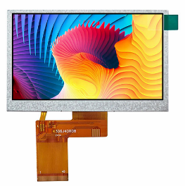

# 2.3.3 LCD 16x2 · Text display

The **LCD 16x2** is a text display with **2 lines** of **16 characters**.  
It is usually based on the **HD44780** controller or compatible.

In this repository it is used to:

- Show messages and system states.
- Display measurements (e.g., HC-SR04 distance).
- Create small user interfaces with simple menus.

---

## Typical connection modes

### Parallel mode (4-bit)

The LCD is controlled with several lines:

- `LCD_RS` → Register Select (command/data).
- `LCD_EN` → Enable (latch).
- `LCD_D[3:0]` → 4 data lines.
- `VCC`, `GND` → power.
- `VO` → contrast (usually via a potentiometer).

In code you may find signals such as:

- `lcd_rs`
- `lcd_en`
- `lcd_data[3:0]`

This mode requires more FPGA pins, but control is direct.

### I²C backpack mode

Some modules include a small PCB that converts I²C to HD44780 signals.

In that case:

- Only `SCL` and `SDA` go to the backpack.
- The backpack internally handles `RS`, `EN`, and `D[3:0]`.

---

## Key concepts

### Initialization

The LCD requires an **initialization sequence**:

- Data mode (4-bit).
- Number of lines.
- Display and cursor enable.
- Clear screen.

This sequence must respect specific timing between commands.

### Writing text

Once initialized, you can:

- Send commands to position the cursor (e.g., start of line 1 or 2).
- Send ASCII characters to appear on screen.

Example use:

- Line 1 → fixed message (“DISTANCE:”).
- Line 2 → numeric value and units (“  23 cm”).

---

## Logical signals and pins

Example signals (4-bit mode):

- `lcd_rs`
- `lcd_en`
- `lcd_d[3:0]`

The assignment to physical FPGA pins is documented in:

- `2_1_Boards/2_1_1_Tang_Nano_9K/docs/pinout.md`
- `2_1_Boards/2_1_1_Tang_Nano_9K/constr/tang-nano-9k.cst`

---

## Relationship with theory

This device relies on:

- `1_2_3_Modules_and_Ports.md`  
  Organization of the LCD controller module.

- `1_2_4_Combinational_vs_Sequential.md`  
  Sequential logic to send commands in order.

- `1_2_5_Registers_and_Clock.md`  
  Data storage and timing control.

- `1_2_6_Timing_and_Dividers.md`  
  Delays between initialization and write commands.

- `1_2_13_LCD_HD44780_Basics.md`  
  More details about the protocol and simple examples.

---

## Related examples, activities, and labs

Typical ideas:

- **Examples**
  - Display “HELLO” on line 1.
  - Display a counter incrementing periodically.

- **Activities**
  - Show HC-SR04 distance on line 2.
  - Change the message based on FSM state.

- **Labs / Implementation**
  - Mini-project with:
    - Menu on line 1  
    - Value on line 2  
    (e.g., modes or parameters controlled by buttons or encoder)

Exact names of Examples/Activities/Labs will be defined later.

---
